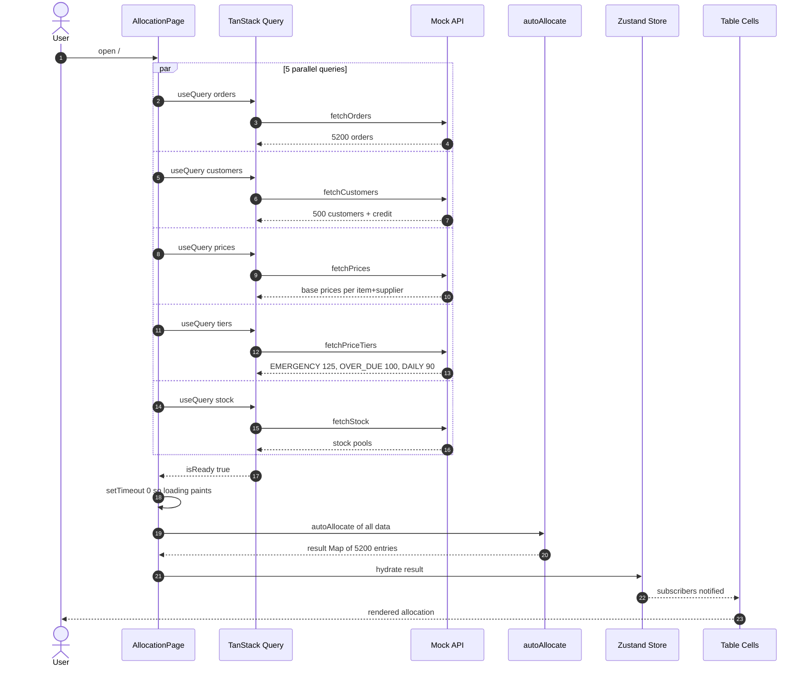
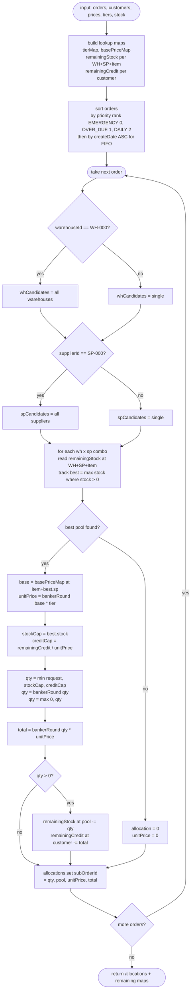
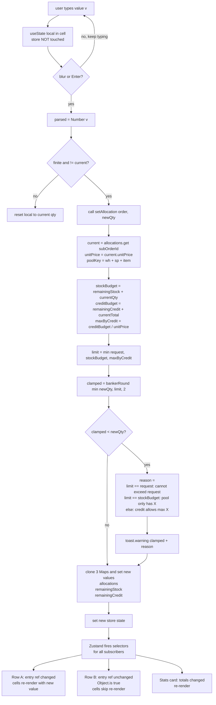
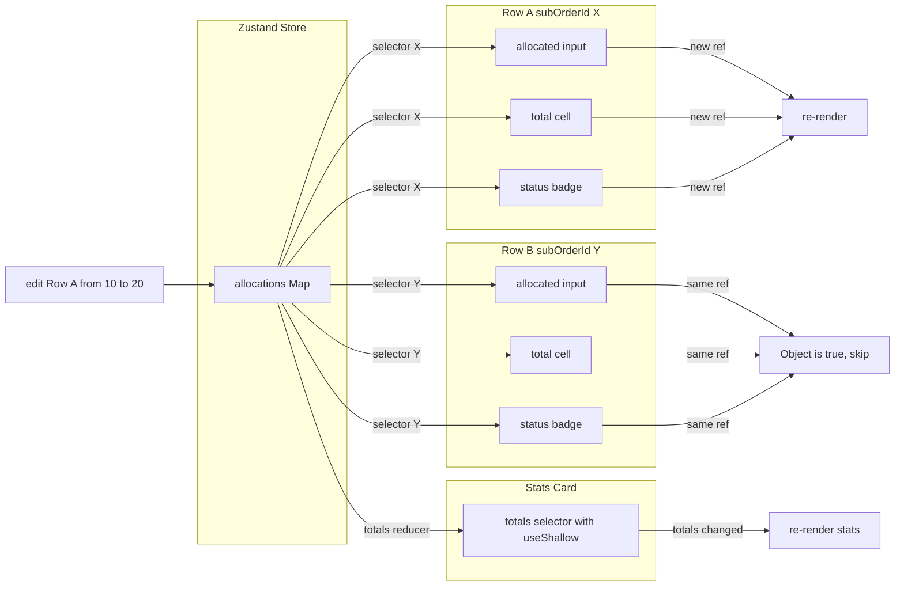

# Salmon Allocation

หน้า admin สำหรับจัดสรรปลาแซลมอนให้ order ตาม priority + stock + credit ของลูกค้า

Live: https://spuict.web.app/

## Stack

- Vite + React + TypeScript
- Tailwind v4 + shadcn/ui
- Zustand
- TanStack Query
- TanStack Table + TanStack Virtual
- React Router v6

## ที่ทำได้

- เปิดหน้าแล้ว auto allocate ให้เลย จัด Emergency ก่อน แล้ว Overdue แล้ว Daily
- ใน type เดียวกันใช้ FIFO (order เก่ามาก่อน)
- WH-000 / SP-000 = ใช้ที่ไหนก็ได้ เลือกตัวที่มี stock เหลือเยอะสุด
- ราคา = base * tier (Emergency 125%, Overdue 100%, Daily 90%) ใช้ banker rounding 2 ตำแหน่ง
- กดแก้ allocated เองได้ ถ้าใส่เกิน stock หรือ credit ระบบจะ clamp ให้
- mock data 5,200 sub orders, table virtualized

## รัน local

```
npm install
npm run dev
```

## Build + deploy

```
npm run build
firebase deploy --only hosting
```

## โครงสร้าง

```
src/
  app/             providers, routes
  components/
    ui/            shadcn
    layout/        sidebar, header
    common/        data-table, page-header, stat-card
  features/
    allocation/
      api/         mock data
      lib/         banker round, auto allocate
      hooks/       store + query
      components/  cells, table, toolbar, stats
  hooks/           use-theme, use-mobile
  lib/             utils, format, query-client
  stores/          ui store
```

## Logic การทำงาน

### 1. ตอนเปิดหน้า



### 2. autoAllocate วนทีละ order



### 3. ตอน user แก้ allocated เอง



### 4. การกัน re-render


